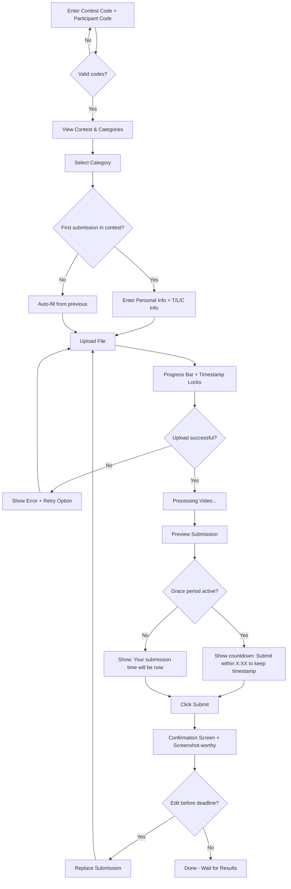
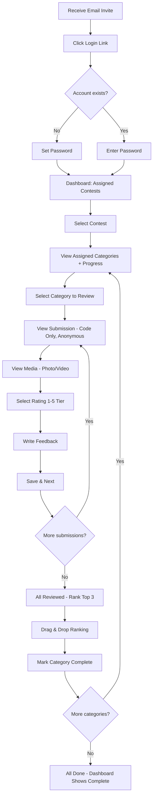
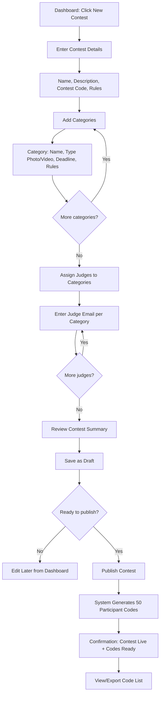
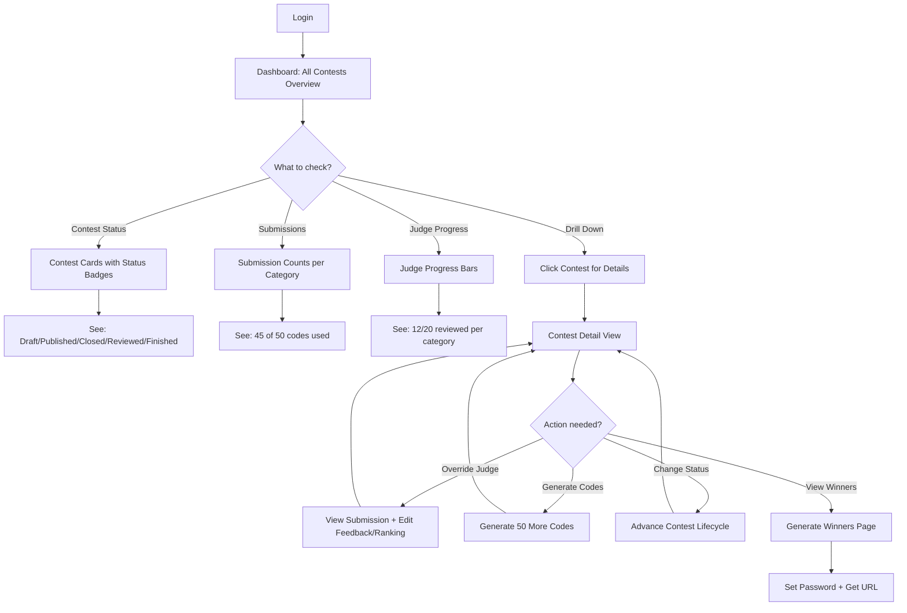

# UX Design Specification: Media Education Solutions

**Author:** NocodeHackers
**Date:** 2026-01-09

---

## Design Direction

**Inspiration:** Linear, shadcn/ui, Untitled UI, Stripe

**Aesthetic:** Modern, sleek, minimal. Clean typography, generous whitespace, subtle animations that feel purposeful rather than decorative. Dark mode consideration. Professional polish that builds trust.

---

## Executive Summary

### Project Vision

Media Education Solutions is a contest management platform that transforms manual coordination chaos into orchestrated simplicity. The platform serves three distinct user types — each should feel like it was purpose-built for them. Built with a modern, sleek aesthetic inspired by Linear, shadcn/ui, Untitled UI, and Stripe.

### Target Users

| User | Tech Comfort | Primary Emotion | UX Priority |
|------|--------------|-----------------|-------------|
| **Jeb (Super Admin)** | High | "I need control without overwhelm" | Dashboard clarity, batch operations, zero guesswork |
| **Judges** | Low | "Just tell me what to do" | Pristine simplicity, obvious progress, one-thing-at-a-time |
| **Participants** | High | "Will this work? Please work." | Upload confidence, deadline assurance, clear confirmation |
| **T/L/C** | Irrelevant | "Don't make me log in" | Email-only interaction |

### Key Design Challenges

1. **The Judge Paradox** — Domain experts who are NOT tech-savvy. Interface must feel so obvious that reluctant judges think "that was... actually fine" after their first session. Zero learning curve.

2. **Deadline Crunch Anxiety** — Participants uploading large videos minutes before deadline need absolute confidence. Progress indicators must be butter-smooth, confirmation unmistakable.

3. **Anonymous-to-Revealed Transition** — Judges see only codes during review, but Admin sees everything. Admin view must surface participant data without breaking the mental model of anonymous judging.

4. **Multi-Role, Single Platform** — Three distinct experiences sharing one codebase. Each role should feel purpose-built, not compromised.

### Design Opportunities

1. **Visual Sophistication** — Linear-inspired visual language: subtle gradients, refined typography, generous whitespace, premium "this feels expensive" quality across all screens.

2. **Progress-as-Delight** — Judge progress bars that feel satisfying to fill. Subtle dopamine hit at completion with clean completion states.

3. **Upload Confidence Theater** — Make upload experience feel expensive. Smooth progress, processing states, preview before submit, unmistakable confirmation.

4. **Contextual Density** — Admin dashboard can be data-rich; Judge view should be zen-minimal. Same design system, different information density per role.

## Core User Experience

### Defining Experience

The platform serves three distinct user types with fundamentally different core actions:

| Role | Primary Action | Frequency |
|------|---------------|-----------|
| **Super Admin (Jeb)** | Creating/editing contests + monitoring progress + overriding judges | Daily during active contests |
| **Judges** | Rating submissions + writing feedback + ranking top 3 | Session-based (45-min blocks) |
| **Participants** | Uploading creative work + confirming submission | One-time per category (with possible edits) |

The platform must excel at all three, but **Judge review flow** is the make-or-break interaction — frustrated judges create support burden for Jeb, undermining the platform's core value proposition.

### Platform Strategy

**Primary:** Desktop/laptop (all user types)
**Secondary:** Mobile responsive (same interface, fluid adaptation)

- No separate mobile-specific interfaces or touch-optimized variants
- Responsive design ensures usability across screen sizes
- Participants may occasionally submit from mobile (CapCut editors, etc.)
- Judges may review on-the-go in limited scenarios
- Admin workflows assume full keyboard/mouse environment

### Effortless Interactions

| Role | Effortless Moment | Design Implication |
|------|-------------------|-------------------|
| **Jeb** | "How is this contest doing?" | Dashboard answers in one glance — no clicks required |
| **Judges** | "What do I review next?" | Obvious next action, never ambiguous |
| **Participants** | "Did my upload work?" | Unmistakable confirmation, no uncertainty |

### Critical Success Moments

1. **Upload Completion** — Sofia at 11:51 PM must feel absolute certainty her submission succeeded
2. **Judge First Session** — Marcus's first 10 minutes determine if he'll finish or abandon
3. **Contest Launch** — Jeb publishing a contest and seeing codes generate instantly
4. **Deadline Crunch** — 100+ simultaneous uploads completing without failure

### Experience Principles

1. **Clarity Over Cleverness** — Every screen answers "what do I do here?" in under 3 seconds
2. **Confidence at Every Step** — Users always know: Did it work? What's next? Am I done?
3. **Desktop-First, Responsive Always** — Optimize for laptop workflows, never break on mobile
4. **Reliability is UX** — Technical performance IS the user experience
5. **Role-Appropriate Density** — Same design system, right information density per context

## Desired Emotional Response

### Primary Emotional Goals

| User | Emotional Arc | Design Goal |
|------|---------------|-------------|
| **Jeb (Super Admin)** | Overwhelmed → In Control | "I've got this" — platform reduces cognitive load, not adds to it |
| **Judges** | Skeptical → Surprised Relief | "That was actually fine" — zero learning curve, obvious next steps |
| **Participants** | Deadline Anxiety → Confident Relief | "It worked!" — unmistakable confirmation, pride in submission |

### Emotional Journey Mapping

**First Discovery:**
- Jeb: "This looks like it'll actually solve my problem"
- Judges: "Okay, this doesn't look complicated"
- Participants: "I know exactly what to do"

**Core Experience:**
- Jeb: Calm confidence while monitoring multiple contests
- Judges: Focused flow state, one submission at a time
- Participants: Trust during upload, anticipation while processing

**Task Completion:**
- Jeb: Satisfaction seeing contests progress without intervention
- Judges: Accomplishment at "18 of 18 reviewed" — a job well done
- Participants: Relief and pride at confirmed submission

**Error States:**
- All users: Calm, clear, honest — never panicky or vague
- Actionable recovery: "Your upload was interrupted at 67%. Resume?"
- Reassurance: Progress is saved, nothing is lost

### Micro-Emotions

| Emotion Pair | Priority | Design Implication |
|--------------|----------|-------------------|
| **Confidence vs. Confusion** | Critical | Every action has clear feedback, every screen has obvious next step |
| **Trust vs. Skepticism** | Critical | Explicit confirmations, visible saves, reliable infrastructure |
| **Accomplishment vs. Frustration** | High | Progress indicators, completion celebrations, batch operations |
| **Calm vs. Anxiety** | High | Generous timeouts, graceful error handling, reassuring copy |

### Design Implications

| Emotional Goal | UX Design Approach |
|----------------|-------------------|
| "I've got this" (Jeb) | Dashboard that answers questions at a glance, no hunting for information |
| "That was fine" (Judges) | One-thing-at-a-time interface, obvious progress, clear completion |
| "It worked!" (Participants) | Upload progress theater, unmistakable confirmation, preview before submit |
| Calm error states | Specific error messages, clear recovery paths, saved progress indicators |

### Emotional Design Principles

1. **Confidence Through Clarity** — Every interaction confirms what happened and what's next
2. **Trust Through Reliability** — The platform does what it says, saves what it should, never loses work
3. **Accomplishment Through Progress** — Visible progress creates momentum and satisfaction
4. **Calm Through Honesty** — When things go wrong, be specific, actionable, and reassuring
5. **Relief Through Simplicity** — Reduce cognitive load; the platform thinks so users don't have to

## UX Pattern Analysis & Inspiration

### Inspiring Products Analysis

| Product | Core Strength | Key Lesson for Media Education Solutions |
|---------|---------------|------------------------------------------|
| **Linear** | Minimal chrome, subtle gradients, typography that breathes | Information density without clutter — Jeb's dashboard can be data-rich without feeling overwhelming |
| **shadcn/ui** | Component consistency, accessible defaults, "copy and own" philosophy | Sensible defaults — every button, input, card works beautifully without heavy customization |
| **Untitled UI** | Enterprise polish with startup aesthetics, clean data tables, scalable tokens | Dashboard patterns — lots of information, zero confusion; perfect for contest monitoring |
| **Stripe** | "Feels expensive" quality, intentional micro-interactions, helpful error states | Trust through polish — every detail signals competence; critical for upload confidence |

### Transferable UX Patterns

**Navigation & Layout (from Linear + Untitled UI)**
- Sidebar navigation with clear hierarchy
- Contextual headers that tell you where you are
- Generous whitespace that lets content breathe
- Subtle borders and shadows, never heavy dividers

**Components & Interactions (from shadcn/ui + Stripe)**
- Consistent button hierarchy (primary/secondary/ghost)
- Form inputs with clear focus states and inline validation
- Cards with subtle hover states
- Toast notifications for confirmations and errors

**Data Display (from Linear + Untitled UI)**
- Tables that scale gracefully with data volume
- Progress indicators that feel satisfying to watch
- Status badges with semantic colors (not just red/green)
- Metric cards that answer questions at a glance

**Feedback & Confirmation (from Stripe)**
- Micro-animations on state changes (not decorative, functional)
- Explicit success states ("Saved" not just removing a spinner)
- Error messages with context and recovery actions
- Loading states that indicate progress, not just "working..."

### Anti-Patterns to Avoid

| Anti-Pattern | Why It Fails | Our Alternative |
|--------------|--------------|-----------------|
| **Modal overload** | Interrupts flow, feels like being trapped | Inline editing, slide-overs for complex forms |
| **Vague confirmations** | "Success!" means nothing | Specific: "Contest published. 50 codes generated." |
| **Hidden actions** | Three-dot menus for primary actions | Primary actions visible, secondary in menus |
| **Skeleton overuse** | Can feel slower than spinners for quick loads | Skeletons for content, spinners for actions |
| **Aggressive validation** | Yelling at users before they finish typing | Validate on blur, show errors gently |
| **Dark mode complexity** | Toggle adds maintenance burden, edge cases | Light mode only — clean, consistent, maintainable |
| **Keyboard shortcut overload** | Power-user features that most users ignore | Minimal shortcuts for genuinely useful actions only |

### Design Inspiration Strategy

**Adopt Directly:**
- Untitled UI's Inter typeface and typography scale
- shadcn/ui component patterns (buttons, inputs, cards, tables)
- Stripe's error state copywriting approach
- Untitled UI's dashboard card patterns
- Linear's whitespace philosophy

**Adapt for Our Context:**
- Linear's information density — simplify for Judge's "one thing at a time" need
- Stripe's polish level — maintain for critical paths (upload, submission), lighter touch elsewhere
- Untitled UI's data tables — streamline for our specific contest/category/submission hierarchy

**Explicit Constraints:**
- Light mode only (no dark mode, no toggle)
- Inter typeface throughout
- Minimal keyboard shortcuts:
  - **Esc** — exit fullscreen view
  - **Spacebar** — play/pause video
  - **← →** — previous/next submission (Judge review only)

## Design System Foundation

### Design System Choice

**Primary:** shadcn/ui + Tailwind CSS
**Typography:** Inter
**Mode:** Light only

This combination provides:
- Linear/Untitled UI/Stripe-level polish out of the box
- Full ownership of component code (copy into project, not npm dependency)
- Tailwind's utility-first approach for consistent spacing and styling
- Accessible, keyboard-navigable components by default

### Rationale for Selection

| Requirement | How shadcn/ui + Tailwind Delivers |
|-------------|----------------------------------|
| Modern, sleek aesthetic | Matches Linear/Untitled UI visual language exactly |
| Inter typeface | Default font, no configuration needed |
| Component consistency | Pre-built, tested components with unified API |
| React + Vite stack | Native integration, no adapters needed |
| Customization control | Own the code, modify freely, no vendor lock-in |

### Implementation Approach

**Component Library Discipline (CRITICAL)**

Every UI element MUST use shared components from the design system. No exceptions.

| Rule | Rationale |
|------|-----------|
| All buttons use `<Button>` component | Update once, propagate everywhere |
| All inputs use `<Input>` component | Consistent validation, focus states, sizing |
| All cards use `<Card>` component | Unified shadows, borders, padding |
| No inline Tailwind for component-level styling | Prevents visual drift and inconsistency |
| New patterns go into component library first | Then used across the app |

**Folder Structure:**
```
src/
  components/
    ui/           # shadcn/ui base components (Button, Input, Card, etc.)
    composed/     # App-specific composed components (SubmissionCard, RatingScale, etc.)
```

**Enforcement:**
- Code reviews must verify component library usage
- No raw `<button>` or `<input>` elements in feature code
- Tailwind utilities allowed for layout (flex, grid, spacing) but not for component styling

### Customization Strategy

**Design Tokens (via Tailwind config):**
- Colors: Primary, secondary, success, warning, error, neutral scale
- Spacing: Consistent 4px base unit
- Border radius: Subtle, consistent across components
- Shadows: Minimal, purposeful (not decorative)

**Component Variants:**
- Button: primary, secondary, ghost, destructive
- Badge: status colors mapped to contest/submission states
- Progress: Linear style for judge review progress

**Custom Components (to build):**
- `<UploadProgress>` — Stripe-quality upload experience
- `<RatingScale>` — 5-tier judge rating with visual feedback
- `<SubmissionCard>` — Anonymous submission display for judges
- `<ContestStatusBadge>` — Draft/Published/Closed/Reviewed/Finished states

## Defining Experience

### The Core Moment

**"Upload and be certain"**

The participant upload experience is the defining interaction for Media Education Solutions. This is the highest-stakes moment — Sofia at 11:59 PM, racing the deadline, needing absolute confidence that her work is safe.

If we nail this moment, everything else follows:
- Participants trust the platform
- Jeb doesn't get "did my upload work?" emails
- The product earns word-of-mouth recommendations

### User Mental Model

**What participants expect:**
- Progress that feels real (not fake progress bars)
- Clear feedback at every stage
- Ability to preview before final submit
- Unmistakable confirmation when done
- Graceful handling if something goes wrong

**Current frustrations with uploads:**
- Vague progress indicators
- No idea if it's working or frozen
- Unclear error messages when something fails
- Anxiety about whether it actually went through

### Success Criteria

| Criteria | Target |
|----------|--------|
| **Confidence** | User never wonders "is it working?" |
| **Progress clarity** | Percentage + speed + time remaining visible |
| **Deadline fairness** | Timestamp captured at upload START, not completion |
| **Completion certainty** | Unmistakable confirmation with timestamp |
| **Verification** | Preview before final submit |

### Submission Timestamp Logic (CRITICAL)

To protect participants with slow connections during deadline crunch:

| Event | Timestamp Behavior |
|-------|-------------------|
| Upload starts at 11:59 PM | Timestamp **locks** at 11:59 PM |
| Upload completes at 12:03 AM | Grace period begins (10-15 minutes) |
| Submit clicked within grace period | Submission time = **11:59 PM** (protected) |
| Submit clicked after grace period expires | Submission time = **actual click time** (late) |

**UX Implications:**
- Show locked timestamp prominently during upload: "Your submission time: 11:59 PM"
- After upload completes, show countdown: "Submit within 14:32 to keep your 11:59 PM timestamp"
- If grace period expires, update messaging: "Your submission time will be when you click Submit"

### Experience Mechanics

**Stage 1: Initiation**
- Generous drag-and-drop zone (not a tiny button)
- File specs visible: "Up to 500MB • MP4, MOV, WebM"
- Instant validation before upload begins (format, size)
- Click-to-browse as fallback

**Stage 2: Upload Progress**
- **Timestamp locks when upload starts** — display prominently
- Smooth progress bar (no jumps or freezes)
- Real metrics: "67% • 2.3 MB/s • ~45 seconds remaining"
- Connection quality indicator
- Cancel option always visible

**Stage 3: Processing**
- "Processing video..." state after upload completes
- Explain what's happening: "Preparing your video for playback..."
- Show processing progress if available from Bunny
- Grace period countdown begins

**Stage 4: Preview**
- Thumbnail generated and displayed
- Play button to verify correct file
- File details visible (duration, size)
- Grace period countdown visible: "Submit within 12:45 to lock your 11:59 PM time"

**Stage 5: Confirmation**
- Big submit button: "Submit to [Category Name]"
- Post-submit confirmation screen:
  - Green checkmark, unmistakable success
  - "Submitted at 11:59 PM — before the 12:00 AM deadline"
  - Submission reference code
  - "You can edit until [deadline]" if applicable
  - Screenshot-worthy for Sofia to send to her coach

**Error Handling**
- Connection slow: "Upload continuing... connection is slow but stable"
- Connection lost: "Connection interrupted. [Try again]" (resumable upload if Bunny supports it — verify during implementation)
- File rejected: Specific reason + what to do ("File is 520MB. Maximum is 500MB. [Choose different file]")
- Server error: "Something went wrong on our end. [Try again] — your file is safe locally"

### Pattern Classification

**Established patterns we're using:**
- Drag-and-drop upload (Dropbox, Google Drive)
- Progress bar with real metrics (WeTransfer)
- Preview before submit (YouTube)
- Confirmation with timestamp (form submissions)

**Our refinements:**
- Timestamp locks at upload START (deadline fairness)
- Grace period with visible countdown
- "Deadline-aware" messaging throughout
- Screenshot-worthy confirmation (Sofia texts her coach)

**Implementation Notes:**
- Resumable uploads: Verify if Bunny supports this; if not, design graceful retry
- Grace period duration: Recommend 10-15 minutes, confirm with Jeb

## Visual Design Foundation

### Design Aesthetic

**Premium European Design Language**

The visual identity draws from Scandinavian/Swiss design principles:
- Restraint as luxury — every element earns its place
- Whitespace as a design element, not empty space
- Typography-forward hierarchy
- Color used sparingly and purposefully
- Quiet confidence over flashy decoration

### Color System

**Foundation:** Untitled UI color palette

**Neutral Scale (Primary UI Colors):**
| Token | Usage |
|-------|-------|
| Gray-50 | Page backgrounds |
| Gray-100 | Card backgrounds, subtle borders |
| Gray-200 | Dividers, disabled states |
| Gray-300 | Borders |
| Gray-400 | Placeholder text |
| Gray-500 | Secondary text |
| Gray-600 | Body text |
| Gray-700 | Headings |
| Gray-900 | Primary text, high contrast |

**Brand/Primary Color:**
- Untitled UI primary (clean blue or neutral accent)
- Used sparingly: primary buttons, active states, key actions
- Not splashed everywhere — reserved for what matters

**Semantic Colors:**
| Token | Color | Usage |
|-------|-------|-------|
| Success | Green | Confirmations, completed states, "Submitted successfully" |
| Warning | Amber | Deadlines approaching, grace period countdown |
| Error | Red | Failed uploads, validation errors |
| Info | Blue | Informational messages, tips |

**Status Badge Colors (Contest/Submission States):**
| Status | Color Treatment |
|--------|----------------|
| Draft | Gray, muted |
| Published | Blue, active |
| Closed | Amber, attention |
| Reviewed | Purple, progress |
| Finished | Green, complete |

### Typography System

**Typeface:** Inter

**Type Scale:**
| Level | Size | Weight | Usage |
|-------|------|--------|-------|
| Display | 36-48px | 600 | Hero headings (rare) |
| H1 | 30px | 600 | Page titles |
| H2 | 24px | 600 | Section headings |
| H3 | 20px | 500 | Card titles, subsections |
| H4 | 16px | 500 | Labels, small headings |
| Body | 16px | 400 | Primary content |
| Body Small | 14px | 400 | Secondary content, metadata |
| Caption | 12px | 400 | Timestamps, hints, labels |

**Line Heights:**
- Headings: 1.2-1.3 (tight)
- Body: 1.5-1.6 (comfortable reading)

**Letter Spacing:**
- Headings: -0.02em (slightly tighter)
- Body: Normal
- All caps labels: +0.05em (slightly looser)

### Spacing & Layout Foundation

**Base Unit:** 4px (Tailwind default)

**Spacing Scale:**
| Token | Value | Usage |
|-------|-------|-------|
| xs | 4px | Tight element spacing |
| sm | 8px | Related element groups |
| md | 16px | Component internal padding |
| lg | 24px | Section spacing |
| xl | 32px | Major section breaks |
| 2xl | 48px | Page section separation |

**Role-Based Density:**

| Role | Density | Rationale |
|------|---------|-----------|
| **Admin (Jeb)** | Higher density | Needs to scan lots of data quickly; comfortable with information-rich views |
| **Judges** | Medium-low density | Focus on one submission at a time; reduce cognitive load |
| **Participants** | Low density | Generous spacing builds confidence; reduces anxiety during upload |

**Layout Principles:**
- Max content width: 1280px (centered on large screens)
- Sidebar navigation: 256px fixed width
- Card padding: 24px standard
- Form field spacing: 16px between fields
- Button spacing: 12px between grouped buttons

### Accessibility Considerations

**Contrast Ratios:**
- Body text on backgrounds: Minimum 4.5:1 (WCAG AA)
- Large text (18px+): Minimum 3:1
- Interactive elements: Clear focus states with visible outlines

**Touch Targets:**
- Minimum 44x44px for interactive elements
- Generous click/tap areas on mobile

**Color Independence:**
- Never rely on color alone to convey meaning
- Status badges include text labels, not just color
- Error states include icons + text, not just red color

**Reduced Motion:**
- Respect `prefers-reduced-motion` system setting
- Animations are subtle and purposeful, not decorative
- No auto-playing animations or videos

## Design Direction Decision

### Chosen Direction

**Premium European Design** — A singular, cohesive direction established through collaborative discovery.

| Element | Decision |
|---------|----------|
| **Aesthetic** | Scandinavian/Swiss restraint — every element earns its place |
| **Color System** | Untitled UI palette |
| **Typography** | Inter |
| **Components** | shadcn/ui + Tailwind CSS |
| **Inspiration** | Linear, Untitled UI, Stripe |
| **Mode** | Light only |
| **Density** | Role-based (dense for Admin, spacious for Judges/Participants) |

### Design Rationale

No exploratory mockups were needed — the design direction emerged clearly through our conversation:

1. **Inspiration alignment** — Linear, Untitled UI, and Stripe share a common visual language that maps directly to implementation via shadcn/ui
2. **Technical consistency** — shadcn/ui + Tailwind provides the exact aesthetic without custom design work
3. **User-appropriate density** — Role-based spacing addresses the distinct needs of power users (Jeb) vs. occasional users (Judges, Participants)
4. **Simplicity** — Light mode only reduces complexity and maintenance burden

### Implementation Approach

The design direction is immediately implementable:
- Install shadcn/ui components into the React + Vite project
- Configure Tailwind with Untitled UI color tokens
- Apply Inter typeface via Google Fonts or local hosting
- Follow component library discipline (all UI from shared components)

No custom design tokens or component variants needed beyond what shadcn/ui provides.

## User Journey Flows

### Flow 1: Participant Upload (Sofia at 11:51 PM)

**Goal:** Submit creative work before deadline with absolute confidence



**Key UX Moments:**
- Timestamp locks when upload STARTS (deadline fairness)
- Grace period countdown after upload completes
- Unmistakable confirmation with timestamp
- Can edit/replace until deadline

---

### Flow 2: Judge Review (Marcus's 45-Minute Session)

**Goal:** Review all submissions efficiently with zero confusion



**Key UX Moments:**
- Progress always visible ("8 of 18 reviewed")
- One submission at a time (focused, not overwhelming)
- Arrow keys for quick navigation
- Satisfying completion state

---

### Flow 3: Admin Contest Creation (Jeb Setting Up)

**Goal:** Create fully-configured contest efficiently



**Key UX Moments:**
- Clear step progression
- Auto-generate 50 codes on publish
- Can save draft and return
- Immediate confirmation with code list

---

### Flow 4: Admin Dashboard (Jeb Checking Status)

**Goal:** Answer "How are my contests doing?" in one glance



**Key UX Moments:**
- Dashboard answers questions without clicking
- Status badges immediately scannable
- Progress bars show judge status at a glance
- Drill-down for actions, not just viewing

---

### Journey Patterns

**Common patterns across all flows:**

| Pattern | Implementation |
|---------|---------------|
| **Entry clarity** | Every flow starts with obvious entry point and clear first action |
| **Progress visibility** | Users always know where they are and what's left |
| **Confirmation explicitness** | Actions that matter get explicit confirmation ("Submitted at 11:51 PM") |
| **Error recovery** | Every failure state has a clear recovery path |
| **Exit clarity** | Users know when they're done and what happens next |

### Flow Optimization Principles

1. **Minimize clicks to value** — Sofia uploads in 4 steps, not 10
2. **Show don't tell** — Progress bars over text descriptions
3. **Smart defaults** — Auto-fill participant info, auto-generate codes
4. **Contextual actions** — Show only relevant actions for current state
5. **Batch operations** — Jeb generates 50 codes at once, not one by one

## Component Strategy

### Design System Components (shadcn/ui)

**Directly usable from shadcn/ui:**

| Category | Components |
|----------|------------|
| **Forms** | Button, Input, Textarea, Select, Checkbox, Form (with React Hook Form + Zod) |
| **Layout** | Card, Dialog, Sheet, Tabs, Separator |
| **Data Display** | Table, Badge, Progress, Avatar, Skeleton |
| **Feedback** | Toast, Alert, Tooltip |
| **Navigation** | Dropdown Menu, Navigation Menu |

All components used as-is with Untitled UI color tokens applied via Tailwind config.

### Custom Components

#### `<UploadProgress>`
**Purpose:** The defining upload experience for participants
**Content:** File name, progress bar, percentage, upload speed, processing state
**States:** Idle, Uploading, Processing, Complete, Error
**Key Feature:** Smooth progress animation, clear error recovery

#### `<RatingScale>`
**Purpose:** 5-tier judge rating selection
**Content:** Five labeled tiers (Developing Skills → Master Creator) with numeric ranges
**States:** Unselected, Hovered, Selected
**Key Feature:** Visual feedback on selection, keyboard accessible

#### `<SubmissionCard>`
**Purpose:** Anonymous submission display for judges
**Content:** Participant code, media thumbnail, rating status, feedback preview
**States:** Unreviewed, In Progress, Reviewed
**Key Feature:** No PII visible — code only

#### `<MediaViewer>`
**Purpose:** Full-screen photo/video display
**Content:** Photo or video with playback controls
**States:** Loading, Playing, Paused, Fullscreen, Error
**Key Feature:** Esc to exit, Spacebar play/pause, arrow keys for next/prev

#### `<CodeListTable>`
**Purpose:** Participant code management for admin
**Content:** Code, status (Used/Unused), participant name if used
**States:** Default, Filtered, Exporting
**Key Feature:** Bulk export, status filtering

#### `<ContestCard>`
**Purpose:** Dashboard overview card for each contest
**Content:** Contest name, status badge, submission count, judge progress
**States:** Draft, Published, Closed, Reviewed, Finished
**Key Feature:** Answers "how is this contest doing?" at a glance

#### `<RankingDropzone>`
**Purpose:** Drag-and-drop top 3 ranking for judges
**Content:** Three numbered positions with submission cards
**States:** Empty, Partially filled, Complete
**Key Feature:** Drag to reorder, visual feedback on drop

### Component Implementation Strategy

**Build Order (by user journey criticality):**

| Priority | Component | Needed For |
|----------|-----------|------------|
| P0 | `<UploadProgress>` | Participant upload (defining experience) |
| P0 | `<RatingScale>` | Judge review flow |
| P0 | `<MediaViewer>` | Judge review flow |
| P1 | `<SubmissionCard>` | Judge review flow |
| P1 | `<ContestCard>` | Admin dashboard |
| P1 | `<RankingDropzone>` | Judge ranking |
| P2 | `<CodeListTable>` | Admin code management |

**Implementation Approach:**
- Build on top of shadcn/ui primitives where possible
- Use Tailwind for styling consistency
- Follow component library discipline (all variants in one file)

## UX Consistency Patterns

### Button Hierarchy

| Level | Style | Usage |
|-------|-------|-------|
| **Primary** | Solid, brand color | One per screen — the main action (Submit, Publish, Save) |
| **Secondary** | Outlined | Alternative actions (Cancel, Back, Save Draft) |
| **Ghost** | Text only | Tertiary actions (Learn more, View details) |
| **Destructive** | Red solid | Dangerous actions (Delete, Remove) — always with confirmation |

**Rules:**
- Never more than one Primary button visible at a time
- Destructive actions require confirmation dialog
- Button text uses verbs: "Submit Entry" not "Submission"

### Feedback Patterns

| Type | Style | Duration | Usage |
|------|-------|----------|-------|
| **Success** | Green toast, top-right | 4 seconds | Confirmations: "Contest published", "Rating saved" |
| **Error** | Red toast, top-right | Until dismissed | Failures: "Upload failed", "Connection lost" |
| **Warning** | Amber inline | Persistent | Deadlines: "Deadline in 2 hours" |
| **Info** | Blue inline | Persistent | Guidance: "Judges will see anonymous codes only" |

**Rules:**
- Success toasts auto-dismiss
- Error toasts require user dismissal (with clear action)
- Never stack more than 2 toasts
- Inline messages for contextual warnings (near the relevant element)

### Form Patterns

**Validation:**
- Validate on blur (not on every keystroke)
- Show errors inline below the field
- Green checkmark for valid fields (optional, not required)
- Error messages are specific: "File must be under 500MB" not "Invalid file"

**Layout:**
- Single column forms (no side-by-side fields except related pairs like city/state)
- Labels above inputs (not inline)
- Required fields marked with subtle asterisk
- Submit button at bottom, full width on mobile

**Auto-save:**
- Admin forms auto-save drafts
- Participant uploads do NOT auto-submit (explicit action required)

### Navigation Patterns

**Admin (Jeb):**
- Sidebar navigation (256px, collapsible on mobile)
- Breadcrumbs for deep navigation (Contest > Category > Submission)
- Tabs for related views (Contest Details, Codes, Judges, Submissions)

**Judge (Marcus):**
- Minimal navigation — focus on the task
- Progress indicator always visible
- Back/Next for sequential review
- No sidebar (distraction-free)

**Participant (Sofia):**
- Step indicator for multi-step flow
- Clear "back" option without losing progress
- No navigation menu (single-purpose flow)

### Empty States

| Context | Message | Action |
|---------|---------|--------|
| No contests | "No contests yet" | "Create your first contest" button |
| No submissions | "No submissions in this category" | Show deadline reminder |
| No assigned reviews | "All caught up!" | Celebrate completion |
| No codes generated | "Codes generate when you publish" | Explain next step |

**Rules:**
- Empty states always explain why it's empty
- Include a primary action when applicable
- Use illustrations sparingly (only if brand includes them)

### Loading States

| Context | Pattern |
|---------|---------|
| Page load | Skeleton (content shapes) |
| Button action | Spinner inside button, button disabled |
| Upload | Progress bar with percentage |
| Data fetch | Skeleton for content area only |

**Rules:**
- Skeletons for content (tables, cards, text)
- Spinners for actions (buttons, submissions)
- Never block the entire screen unless absolutely necessary
- Show progress for anything > 2 seconds

### Status Badge Patterns

| Status | Color | Context |
|--------|-------|---------|
| Draft | Gray | Contest not yet published |
| Published | Blue | Contest accepting submissions |
| Closed | Amber | Submissions closed, judging active |
| Reviewed | Purple | Judging complete, pending finalization |
| Finished | Green | Results published |
| Used | Gray | Participant code has been used |
| Unused | Subtle border only | Participant code available |

**Rules:**
- Badges include text label (not color alone)
- Consistent across all contexts (cards, tables, details)

## Responsive Design & Accessibility

### Responsive Strategy

**Approach:** Desktop-first, responsive adaptation

| Device | Priority | Notes |
|--------|----------|-------|
| Desktop/Laptop | Primary | All users (Admin, Judge, Participant) work primarily here |
| Tablet | Secondary | Occasional judge review, admin monitoring |
| Mobile | Tertiary | Participant uploads (CapCut users), quick status checks |

**Same Interface Philosophy:**
- No separate mobile app or mobile-specific layouts
- Same components, fluidly adapted
- Touch-friendly by default (44px targets)
- Responsive, not redesigned

### Breakpoint Strategy

**Tailwind configuration with MacBook Pro 13" optimization:**

| Breakpoint | Width | Target Device | Layout Behavior |
|------------|-------|---------------|-----------------|
| `sm` | 640px+ | Large phones | Single column, stacked |
| `md` | 768px+ | Tablets | Two-column options |
| `lg` | 1024px+ | Small laptops | Sidebar visible |
| `xl` | 1280px+ | Standard desktops | Full desktop layout |
| `2xl` | 1440px+ | **MacBook Pro 13"** | Optimized primary layout |

**Tailwind Config:**
```js
// tailwind.config.js
theme: {
  screens: {
    'sm': '640px',
    'md': '768px',
    'lg': '1024px',
    'xl': '1280px',
    '2xl': '1440px',  // MacBook Pro 13" - primary target
  }
}
```

**1440px (MacBook Pro 13") Optimization:**
- This is the "golden ratio" layout — perfect first
- Dashboard cards sized optimally for this width
- Tables show all important columns without horizontal scroll
- Sidebar (256px) + content area balanced at this exact width
- Most clients and reviewers will see the product at this resolution

**Key Adaptations:**

| Component | Desktop (lg+) | Mobile (< lg) |
|-----------|---------------|---------------|
| Admin sidebar | Fixed 256px | Hamburger menu / sheet |
| Tables | Full columns | Horizontal scroll or card view |
| Forms | Max-width 600px | Full width, stacked |
| Media viewer | Fullscreen overlay | Fullscreen native |
| Buttons | Inline grouping | Full width, stacked |

### Accessibility Strategy

**Target:** WCAG 2.1 Level AA

| Requirement | Implementation |
|-------------|---------------|
| **Color contrast** | 4.5:1 minimum (body text), 3:1 (large text) |
| **Keyboard navigation** | All interactive elements focusable, logical tab order |
| **Focus indicators** | Visible focus ring on all interactive elements |
| **Screen readers** | Semantic HTML, ARIA labels where needed |
| **Touch targets** | Minimum 44x44px |
| **Reduced motion** | Respect `prefers-reduced-motion` |
| **Text resizing** | Usable up to 200% zoom |

**Role-Specific Considerations:**

| User | Accessibility Notes |
|------|---------------------|
| Jeb (Admin) | Power user, keyboard proficient — ensure shortcuts work |
| Judges | Potentially older users — ensure good contrast, readable text |
| Participants | Teens with varying abilities — ensure upload flow is screen-reader friendly |

### Testing Strategy

**Responsive Testing:**
- Chrome DevTools device simulation for layout verification
- Real device testing: iPhone, Android phone, iPad
- **MacBook Pro 13" (1440px) as primary QA device**
- Browser testing: Chrome, Safari, Firefox, Edge

**Accessibility Testing:**
- Automated: axe DevTools, Lighthouse accessibility audit
- Manual: Keyboard-only navigation testing
- Screen reader: VoiceOver (Mac/iOS), NVDA (Windows)
- Color: Contrast checker, colorblind simulation

**Acceptance Criteria:**
- Lighthouse accessibility score ≥ 90
- Zero critical axe violations
- Complete keyboard navigation possible
- All form fields have associated labels

### Implementation Guidelines

**Responsive Development:**
- Use Tailwind responsive prefixes consistently
- Mobile styles as default, enhance with `sm:`, `md:`, `lg:`, `xl:`, `2xl:`
- Use `rem` and `%` over fixed `px` where appropriate
- Test touch targets on actual devices
- Ensure forms are usable on mobile keyboards

**Accessibility Development:**
- Semantic HTML: `<main>`, `<nav>`, `<section>`, `<article>`, `<button>`
- Headings: Logical hierarchy (h1 → h2 → h3), never skip levels
- Images: Alt text for informational images, empty alt for decorative
- Forms: `<label>` associated with every input, error messages linked via `aria-describedby`
- Focus: Never remove focus outlines, customize with visible styles
- Dynamic content: `aria-live` regions for toasts and status updates

---

*UX Design Specification Complete — 2026-01-09*
