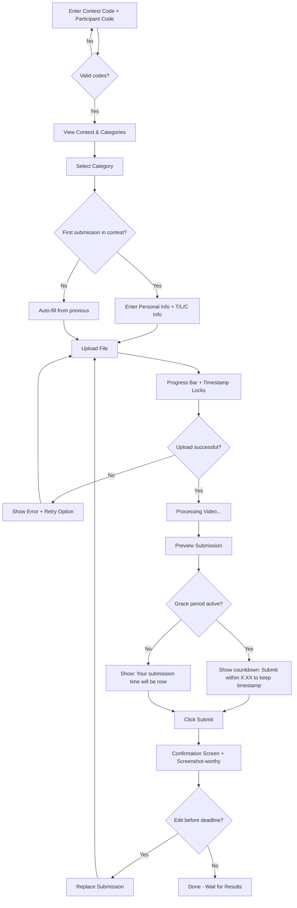
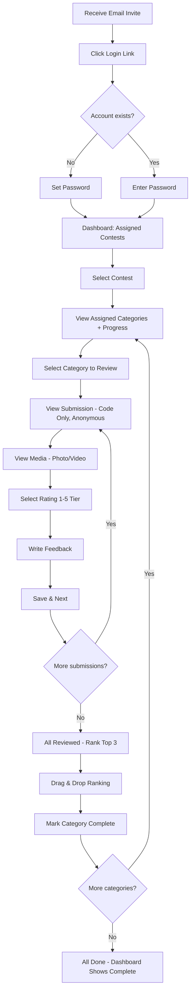
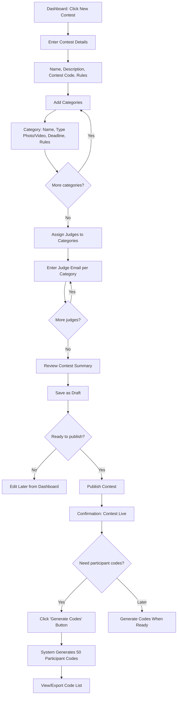
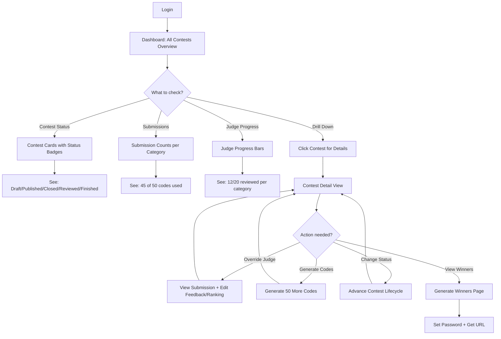

# User Journey Flows

## Flow 1: Participant Upload (Sofia at 11:51 PM)

**Goal:** Submit creative work before deadline with absolute confidence

**Key UX Moments:**
- Timestamp locks when upload STARTS (deadline fairness)
- Grace period countdown after upload completes
- Unmistakable confirmation with timestamp
- Can edit/replace until deadline

---

## Flow 2: Judge Review (Marcus's 45-Minute Session)

**Goal:** Review all submissions efficiently with zero confusion

**Key UX Moments:**
- Progress always visible ("8 of 18 reviewed")
- One submission at a time (focused, not overwhelming)
- Arrow keys for quick navigation
- Satisfying completion state

---

## Flow 3: Admin Contest Creation (Jeb Setting Up)

**Goal:** Create fully-configured contest efficiently

**Key UX Moments:**
- Clear step progression
- Codes generated on-demand via "Generate Codes" button (not automatic)
- Contest can exist with 0 codes initially
- Can save draft and return
- Generate more codes anytime as needed

---

## Flow 4: Admin Dashboard (Jeb Checking Status)

**Goal:** Answer "How are my contests doing?" in one glance

**Key UX Moments:**
- Dashboard answers questions without clicking
- Status badges immediately scannable
- Progress bars show judge status at a glance
- Drill-down for actions, not just viewing

---

## Journey Patterns

**Common patterns across all flows:**

| Pattern | Implementation |
|---------|---------------|
| **Entry clarity** | Every flow starts with obvious entry point and clear first action |
| **Progress visibility** | Users always know where they are and what's left |
| **Confirmation explicitness** | Actions that matter get explicit confirmation ("Submitted at 11:51 PM") |
| **Error recovery** | Every failure state has a clear recovery path |
| **Exit clarity** | Users know when they're done and what happens next |

## Flow Optimization Principles

1. **Minimize clicks to value** — Sofia uploads in 4 steps, not 10
2. **Show don't tell** — Progress bars over text descriptions
3. **Smart defaults** — Auto-fill participant info, auto-generate codes
4. **Contextual actions** — Show only relevant actions for current state
5. **Batch operations** — Jeb generates 50 codes at once, not one by one
